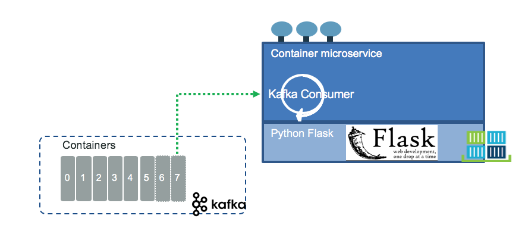
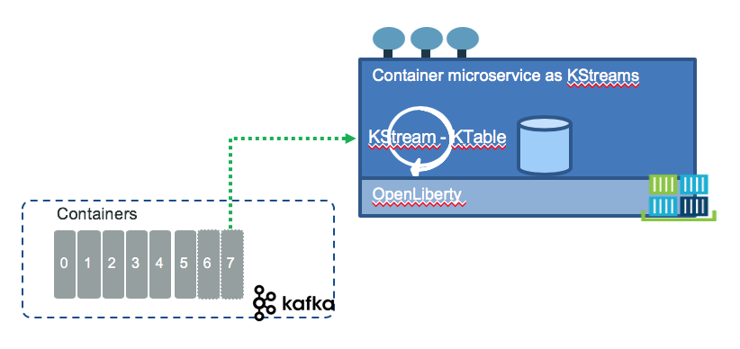

# Container management microservice

This project is part of the container shipment implementation solution you can read detail [here.](https://ibm-cloud-architecture.github.io/refarch-kc/).

The goal of this Container management service is to support the reefer containers inventory management and to process all the events related to the container entity. We are proposing 3 types of implementations:

* Python with Flask and Confluent Kafka API for Python. See [this description](./flask/README.md)
* Microprofile 2.2 using Kafka Streams. See [this description](./kstreams/README.md)
* Springboot and spring kafka template and spring postgreSQL. [See this note](./springboot/README.md)


We want to support the following events:

* ContainerAddedToInventory, ContainerRemovedFromInventory
* ContainerAtLocation
* ContainerOnMaintenance, ContainerOffMaintenance, 
* ContainerAssignedToOrder, ContainerReleasedFromOrder
* ContainerGoodLoaded, ContainerGoodUnLoaded
* ContainerOnShip, ContainerOffShip
* ContainerOnTruck, ContainerOffTruck

This repository illustrates how to implement this service in different ways: kStreams and Python. The features are:

* As a REST API end point calleable from other services.
* As a kafka streams consumer of orderCreated event published in the Kafka `orders` topic: the code will look at the pickup location and searchdx in the container inventory the containers close to this location. 
* As a kafka streams agent consuming container events from the `containers` topic and managing a stateful table to keep container inventory in memory.

Finally an important element of this project is the integration of Kafka topic as datasource to develop a machine learning model for the container predictive maintenance scoring. See details in [this note](./metrics).

## Component view

As the service needs to offer some basic APIs and be able to consumer and produce events the code will have at least two main components: a kafka consumer and a HTTP server exposing REST APIs. The following diagram illustrates a python flask implementation packaged in docker container:

  

and the implementation considerations and best practices are described [here.](./flask/README.md)


The second diagram shows the same service implemented with Apache Kafka KStreams API in Java, deployed in Liberty server with JAXRS API:

  

The implementation description is [here.](./kstreams/README.md)

## Container inventory

We are providing a tool to publish container created events to the Kafka `container` topic. The python code is under the `tools` folder. It can be executed using our Python docker image with the command:

```shell
docker run -e KAFKA_BROKERS=$KAFKA_BROKERS -v $(pwd):/home --network=docker_default -ti ibmcase/python bash
root@2f049cb7b4f2:/ cd home
root@2f049cb7b4f2:/ python ProduceContainerCreatedEvent.py 
```


## Assign container to order

The implementation will search the list of containers closed to the source location. We simplify the implementation by assuming mapping container (longitude, latitude) position to be in an area closed to the harbor close to the pickup location. We do not manage the time when the container will be there. We assume containers is at location at the time of the order is processed, is the same as the time of the pickup. We may fine tune that if we can make it simple.

The output of this assignment processing is an event to the `orders` topic.