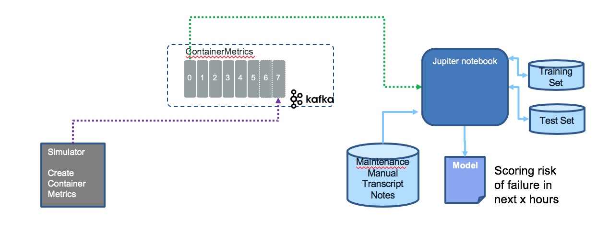

# Reefer Container Metric as IoT

The reefer container is a Internet of Thing device that run motor, compressor to maintain cold inside the container.


The fleetms microservice is generating simulated container metrics events to emulate the container on ship. But this project will add capabilities to generate a lot of data to create training and test set for machine learning exercises for predictive maintentane and cold chain scoring.

## Data set creation for container metrics

As we are not in the business of reefer container shipment we do not have data set. 


## Predictive maintenance
The success of predictive maintenance models depend on three main components: 

* having the right data
* framing the problem appropriately 
* evaluating the predictions properly

From a methodology point of view the Data Scientist needs to address the following questions:

* What type of failure to consider and which one to predict?
* What kind of failure is happening? slow degradation or instantaneous failure?
* What could be the relation between a product characteristics and the failure?
* What kind of measure exist to assess the given characteristic?
* Which measurements correspond to good functioning and which ones correspond to failure?
* How often metrics are reported?
* What question the model should answer?
* What kind of output should the model give?
* How long in advance should the model be able to indicate that a failure will occur?
* What are the business impact to do not predict the failure? and predicting false negative failure?
* What is the expected accuracy?  

There are different meodeling approach to tackle predictive maintenance:

* regression model
* classification to predict failure for a given time period
* classify anomalous behavior: classes are not known in advance. Normal operation is known.
* compute probability of failure over time

### Reefer problem types:

There are multiple different potential issues that could happen to a refrigerator container. We are choosing to model the "Sensor Malfunctions" issue: Sensors in the refrigeration unit need to be calibrated and be continuously operational. An example of failure may come from the air sensor making inaccurate readings of temperatures, which lead to sploiled content. A potential reason may come from a faulty calibration, which can go unnoticed for a good time period. It may be diffiult to know if there is an issue. 

The other common potential issues are:

* Fluid leaks, like engine oil, coolant liquid. The preassure sensors added to the circuit may help identify preassure lost over time.
* Faulty belts and hoses.
* Faulty calibration: A non-calibrated reefer can cool at a slower or faster rate than desired.
* Damaged Air Chute.
* Condenser Issues like broken or damaged coils, clamps or bolts missing, and leaks.
* Door Seals damaged. 
* Blocked air passage: to keep the temperature homogenous inside the reefer.

So the question we want to answer is: does the Reefer keep accurate temperature overtime between what is set verus what is measured?

### Data set

Well we do not have data. But we may be able to simulate them. As this is not production work, we should be able to get the end to end story still working from a solution point of view.

The historical data need to represent failure, and represent the characteristics of a Reefer container. We can imagine it includes a lot of sensors to get interesting correlated or independant features.

### Model


### Simple environment

We propose to code a simulator to create the training and test sets so we can build the model inside Jupiter notebook and with sklearn library. The simulator will be also use as an injector to real time event on loaded containers, used to travel goods, so we can trigger a maintenance order process.

Here is a diagram for the data scientist environment:



For the runtime execution we will plug the model as a consumer of `containerMetrics` topic which keeps container metrics in the form of event like below, keyed by containerID.

```json
{
    "timestamp": 1234567,
    "containerID": "C10",
    
}
```


### References

For modeling predictive maintenance we found [this article](https://medium.com/bigdatarepublic/machine-learning-for-predictive-maintenance-where-to-start-5f3b7586acfb) from BigData Republique, on Medium, very interesting. 


