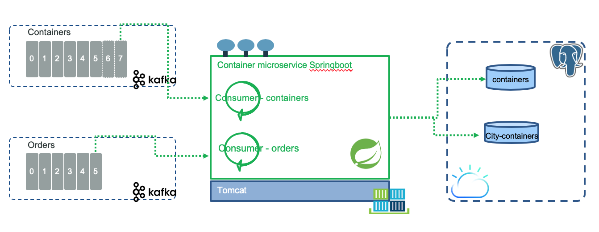
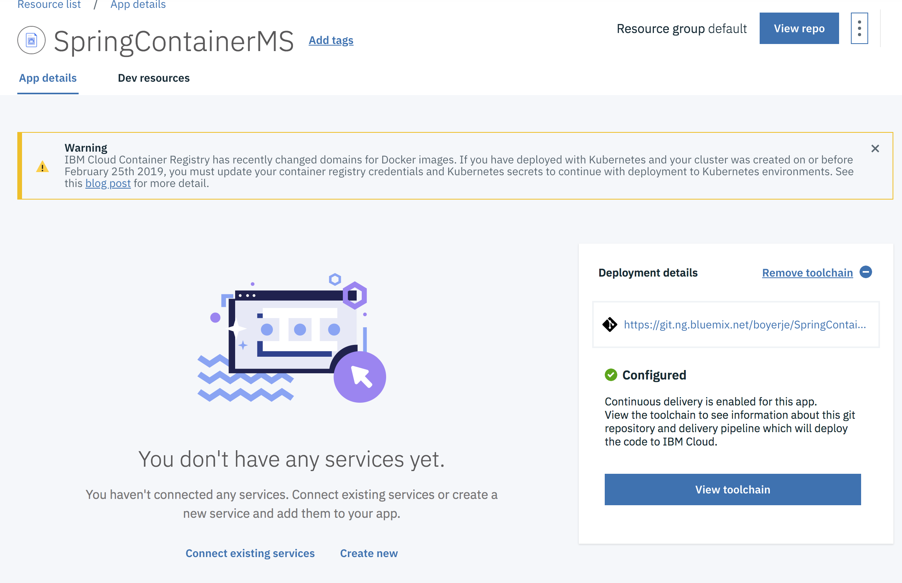

# Springboot - Kafka container microservice

This chapter presents how to develop the Reefer container manager using Spring boot, Kafka template and PostgreSQL, Hibernate JPA using Spring data. This is another way to implement the same specifications and helps us to assess the different technologies to develop event-driven cloud native microservice. The user stories to support are described in [this section](../index.md).



## Start from Spring initializer

Using the [Spring Code generator](https://start.spring.io/) we created the base project. 


The generated code is really minimum and the interesting part is the maven `pom.xml` dependencies. We do not have code related to the selected dependant, no dockerfile and all the goodies to deploy to Kubernetes cluster. 

It is more convenient to start from IBM Cloud starter kit and modify the generared `pom.xml` with the needed dependencies...

## Start from IBM Cloud Starter Kit.

Once logged to IBM Cloud, create a resource and select `Starter kit` in the Catalog, then the `Java microservice with Spring` kit. 


The application is created, you can download the code or create a toolchain so we use a continuous integration and deployment to an existing IBM Kubernetes Service.



So now the repository has Dockerfile, helm chart, CLI configuration, scripts and other manifests... We can build existing code and run it with the following commands:

```shell
$ mvn clean package
$ java -jar target/SpringContainerMS-1.0-SNAPSHOT.jar application.SBApplication
```

Pointing to http://localhost:8080/ will bring the first page. It works! So let break it.

If you did not try it before, and if you are using [Eclipse](https://www.eclipse.org/) last release, you can install Spring IDE plugin: open Marketplace and search for Spring IDE, download release 4.x:


To verify the installation, importing the project as a 'maven' project will let you see the different options like spring boot starters election...

The tools is also available to our second IDE visual studio code. See [this note](https://spring.io/tools) for Spring toools. 

### New pom    

The generated dependencies include Spring boot starter web code, hystrix for circuit breaker and retries, and testing. We need to add kafka and postgreSQL and run `mvn install`.
```
<dependency>
    <groupId>org.springframework.kafka</groupId>
    <artifactId>spring-kafka</artifactId>
</dependency>

<dependency>
    <groupId>org.postgresql</groupId>
    <artifactId>postgresql</artifactId>
    <scope>runtime</scope>
</dependency>
<dependency>
    <groupId>org.springframework.kafka</groupId>
    <artifactId>spring-kafka-test</artifactId>
    <scope>test</scope>
</dependency>
```

## Some Spring boot basis 

We encourage you to go over the different tutorials from spring.io. We followed the following ones to be sure we have some good understanding of the basic components:

* [Springboot](https://spring.io/guides/gs/spring-boot/). Helps to start quickly application. The first class as the main function and run the SpringApplcation. The `@SpringBootApplication` annotation adds configuration to get the spring bean definitions, and auto configure the bean jars needed. As we specified the `pring-boot-starter-web` artifact in the dependencoes the application is a web MVC and includes a Dispatcher servlet. 
* [Data with JPA](https://spring.io/guides/gs/accessing-data-jpa/) addresses creating entity beans, repository as data access object and queries. 
* [Spring Boot, PostgreSQL, JPA, Hibernate RESTful CRUD API Example from Callicoder](https://www.callicoder.com/spring-boot-jpa-hibernate-postgresql-restful-crud-api-example/)
* [Spring Kafka](https://spring.io/projects/spring-kafka)

## Add the get /containers  API

We want to start by the get reefer containers test and then implement a simple container controller bean with CRUD operations. Spring takes into account the package names to manage its dependencies and settings. The test looks like:

```java
 String endpoint = "http://localhost:" + port + "/containers";
String response = server.getForObject(endpoint, String.class);
assertTrue("Invalid response from server : " + response, response.startsWith("["));
```

And the resource class under the package `ibm.labs.kc.containermgr.rest.containers` with naming convention starting from where the `SBApplication` application is (`ibm.labs.kc.containermgr`). 

```java
package ibm.labs.kc.containermgr.rest.containers;
@RestController
public class ContainerController {


    @GetMapping("containers")
    public List<ContainerEntity> getAllContainers() {
    	return new ArrayList<ContainerEntity>;
    }
``` 

The ContainerEntity is a class with JPA annotations, used to control the mapping object to table. Below is a [simple entity definition]():

```java
@Entity
@Table(name = "containers")
public class ContainerEntity implements java.io.Serializable {
	
	@Id
	protected String id;
    protected String type;
	protected String status;
	protected String brand;
}
```

Once we have entity and how it is mapped to a table, the next major step is to add a repository class and configure the application to use Postgress dialect so JPA can generate compatible DDLs. The repository is scrary easy, it just extends a base JpaRepository and specifies the primary key used as ID and the type of record as ContainerEntity.

```java
@Repository
public interface ContainerRepository extends JpaRepository<ContainerEntity,String>{}
```

Spring makes it magic to add save, findById, findAll... operations transparently. So now we can @Autowrite the repository and add the tests and the connection between the rest api and the repo. The test is in the Junit test class: [PostgreSqlTest](src/test/java/ibm/labs/kc/containermgr/PostgreSqlTest.java). In fact for test reason and being able to inject Mockup class in unit test, we inject via contructor.

```java
@Test
	public void testAccessToRemoteDBSpringDatasource() {
		Optional<ContainerEntity> cOut = containerRepo.findById("c1");
		if (!cOut.isPresent()) {
			ContainerEntity c = new ContainerEntity("c1","Brand","Reefer",100,0,0);
			c.setCreatedAt(new Date());
			c.setUpdatedAt(c.getCreatedAt());
			containerRepo.save(c);
            // add asserts...
        }
    }
```

Finally the controller is integrating the repository:
```java
    @Autowired
	private ContainerRepository containerRepository;

    @GetMapping("/containers/{containerId}")
    public ContainerEntity getContainerById(@PathVariable String containerId) {
    	return containerRepository.findById(containerId)
    			.orElseThrow(() -> 
    	 new ResourceNotFoundException("Container not found with id " + containerId));
    }

```

After the tests run successfully with a valid connection to IBM cloud, launching the spring boot app location and going to http://localhost:8080/containers/c1 will give you the data for the Container "c1".   


## Listening to container events

The use story is to get the container event from the kafka `containers` topics and add new container to the inventory, or update existing ones. So we need to add consumer and publisher using [Spring Kafka](https://spring.io/projects/spring-kafka). Spring Kafka template is based on the pure java kafka-clients jar but provide the same encapsulation as JMS template. Here is the [product documentation](https://docs.spring.io/spring-kafka/docs/2.2.4.RELEASE/reference/).  

First we need to start a kafka consumer when the application starts. We want one unique instance, so a singleton. As presented in [this article](https://www.baeldung.com/running-setup-logic-on-startup-in-spring), we select to add a Component that is an application listener so when the spring context is running, we can start consuming message from Kafka.  

```java
@Component
public class ContainerConsumer {
    @EventListener
    public void onApplicationEvent(ContextRefreshedEvent event) {
        // prepare kafka consumer, add an event handler callback and start the consumer
}
```

The code is in the class: `ibm.labs.kc.containermgr.kafka.ContainerConsumer.java`. Spring Kafka container](https://docs.spring.io/spring-kafka/docs/2.2.4.RELEASE/reference/#receiving-messages) is not bringing that much value on top of Kafka Java API, and we tend to prefer learning a unique API and keep programming with the Kafka Java API. 

We have added an end to end integration test to create container events and see the payload persisted in Postgresql.  When running the server locally, you may want to leverage our [docker compose](https://github.com/ibm-cloud-architecture/refarch-kc/blob/master/docker/backbone-compose.yml) file to start a local kafka broker. 


## Manually deploy to IKS

The steps are the same as other project and we are providing the same type of tools:

```shell
# login to IBM Cloud
$ ibmcloud login -a https://api.us-east.bluemix.net
# connect to the IKS cluster
$ ibmcloud ks region-set us-east   
$ ibmcloud ks cluster-config fabio-wdc-07
$ export KUBECONFIG= ~/.bluemix/plugins/container-service/clusters/fabio-wdc-07/kube-config-wdc07-fabio-wdc-07.yml
# login to the private registry
$ ibmcloud cr login
# build the jar and docker image
$ ./script/buildDocker.sh IBMCLOUD
# Push the image
$ docker push  us.icr.io/ibmcaseeda/kc-springcontainerms
# Deploy the Helm release
$ ./scripts/deployHelm
```

If for any reason you get a "image can't be pulled" error. Verify the image is in the registry with the command: `docker cr image-list`. Then if so, verify there is a secret defined to keep the security key to access the registry in the same namespace as you are deploying your app, and this secret is referenced in the yml file:

```
"imagePullSecrets": [
          {
            "name": "browncompute-registry-secret"
          }
        ],
```

If you follow those steps the application is deployed but is not working due to SSL certifications issues. So let deal with security now!.

## Security

To communicate with IBM Cloud PostgresSQl service the client needs to use SSL and the certificates... 
First to avoid sharing userid and password in github, we use environment variables for postgressql url, user and password. There is a `setenv.sh` in the `scripts` folder to use with your own settings. Also to run unit test in eclipse you need to set those environment variables in the run configuration as illustrated in the figure below:


Those variables are using the Spring boot `application.configuration` file.

```
spring.datasource.url=${POSTGRESQL_URL}
```

To create the SSL connection you will need to make the server certificate available to Java, the first step is to convert it to a form Java understands.
To download a text version of the base64 certificate as defined in the connection credentials of the IBM Cloud postgressql service use the following command:

```shell
$ ibmcloud cdb deployment-cacert Green-DB-PostgreSQL
# if you do not have the cloud database plugin does the following and rerun previous command:
$ ibmcloud plugin install cloud-databases
```
Save the certificate to a file (e.g. postgressql.crt). Then transform it to a Java format and save it to a keystore used by Java

```shell
# transform
$ openssl x509 -in postgressql.crt -out postgressql.crt.der -outform der
# save in keystore
$ keytool -keystore mykeystore -alias postgresql -import -file postgressql.crt.der
```

Then adding the following setting will let the Java program accesses the certificate from the keystore.
```
java -jar -Djavax.net.ssl.trustStore=mykeystore -Djavax.net.ssl.trustStorePassword=changeit ${root_folder}/target/SpringContainerMS-1.0-SNAPSHOT.jar application.SBApplication
```

Now to make all this available in docker container we propose to let the previous two commands run within the Dockerfile during the build process.

## Issues

The level of abstraction in Spring is nice when doing basic things but can become a nightmare when doing real bigger application including different libraries. Also migrating or using the last version 2.xx, bring changes to existing code and tests. Below is a list of iisues we spent time on:

* When JPA started, it creates / updates database schema, and for example enforced to have an Id as int while it was as string. As a bypass we create the table before in postsgresql using psql tool.
* When starting the spring data, JPA will try to connect to the PostgresSQL and execute a set of validation, one of them could generate the following exception: `Method org.postgresql.jdbc.PgConnection.createClob() is not yet implemented`. The explanation for the solution is [here](https://vkuzel.com/spring-boot-jpa-hibernate-atomikos-postgresql-exception)
* Testing endpoint /health did not work on Spring 2.1.4. Thisi s due that there is the new Actuator capabilities (`spring-boot-starter-actuator`) that adds endpoints to manage a webapp in production. This is a nice feature. So remove any hold Health api class and modify the url to `/actuator/health`. Be sure to read [this note](https://docs.spring.io/spring-boot/docs/current/reference/html/production-ready-endpoints.html) on actuator.

* Deployed in Kubernetes service, the pod has issue on postgress SSL handshake. (org.postgresql.util.PSQLException: SSL error: Received fatal alert: handshake_failure). This problem is linked to a SSL certificate not found. We need to be sure a Java Keystore is defined and includes the public certificate coming from the server. See [security section](#security) above.


## References

* [Spring Code generator](https://start.spring.io/)
* [Spring Kafka](https://spring.io/projects/spring-kafka) and the spring kafka [documentation](https://docs.spring.io/spring-kafka/docs/2.2.4.RELEASE/reference)
* [sptring Data and JPA](https://docs.spring.io/spring-data/jpa/docs/current/reference/html/)
* [SSL and postgresql]()
* [Runninf postgresql in docker](http://tleyden.github.io/blog/2017/06/14/running-postgresql-in-docker/)